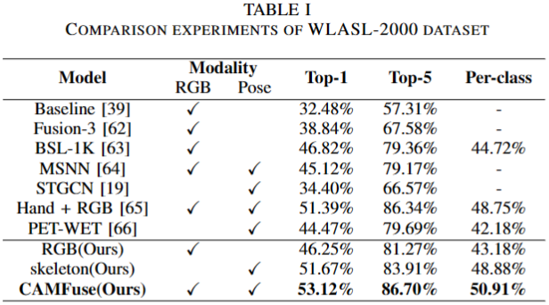
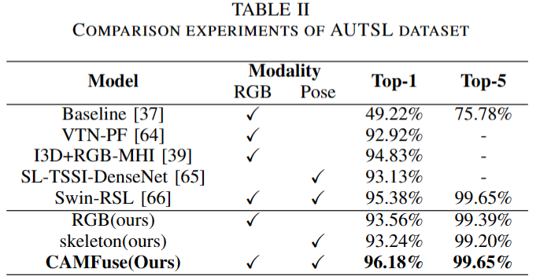
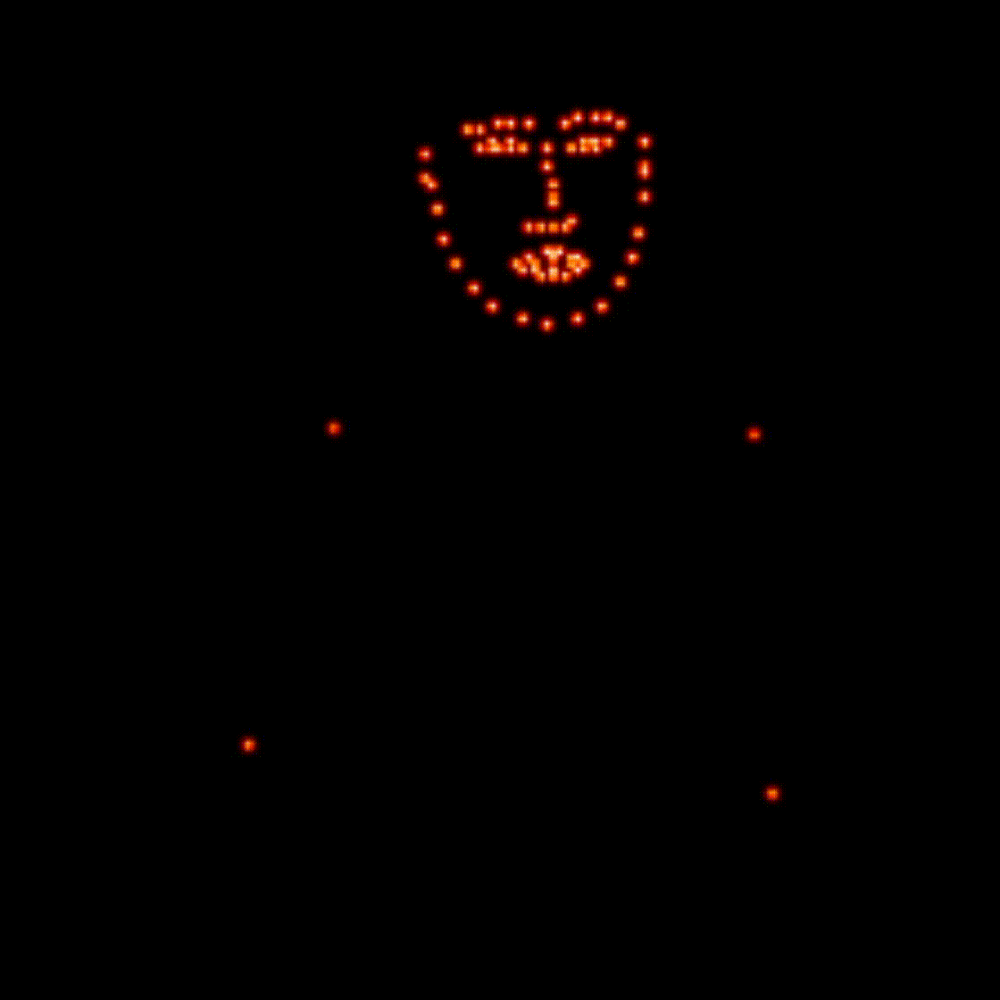

# CAMFuse
By Jing Hu, Zhaojie Ju,Haixing Mai and Qing Gao*.

This repo holds codes of the paper: Holistic-based Cross Attention Modal Fusion Network for Video Sign Language Recognition. 

This repo is based on the OpenSource Project [MMAction2](https://github.com/open-mmlab/mmaction2). Many thanks for their great work! 

<div id="wrapper" align="center">
<figure>
  
  <p style="font-size:1.3vw;">Holistic-based Cross Attention Modal Fusion Network for Video Sign Language Recognition Results on WLASL-2000 dataset. </p>
  <br>
  <p style="font-size:1.3vw;">Holistic-based Cross Attention Modal Fusion Network for Video Sign Language Recognition Results on AUTSL dataset. </p>
</figure>
</div>

Please cite our paper if you find this repo useful in your research.

<!-- <div id="wrapper" align="center">
<figure>
  &emsp;
  <p style="font-size:1.4vw;">An overview of the CAMFuse method. </p>
  <br>
  <p style="font-size:1.2vw;">Illustration of the ST-CAF architecture. </p>
  <br>
  <p style="font-size:1.2vw;">Left: Skeleton-base Action Recognition Results on NTU-RGB+D-120; Right: CPU Realtime Skeleton-base Gesture Recognition Results. </p>
</figure>
</div> -->

<!-- <div id="wrapper" align="center">
<figure>
  &emsp;
  <br>
  <p style="font-size:1.2vw;">Left: Skeleton-base Action Recognition Results on NTU-RGB+D-120; Right: CPU Realtime Skeleton-base Gesture Recognition Results</p>
</figure>
</div> -->

## Supported Video Sign Language Datasets

- [x] [WLASL-2000 (IEEE Access 2020)](
https://doi.org/10.48550/arXiv.1910.11006
) 
- [x] [AUTSL (CVPR 2020)](
https://doi.org/10.48550/arXiv.2008.00932
)

## Prerequisites
1. This project is implemented in the deep learning framework PyTorch 1.11.0 configured with Python 3.8 and CUDA 11.3 versions. Thus please install Pytorch first.
2. Detailed enviroment requirment can be found in requirement.txt in each code folder. You can install other required modules by conducting ```pip install -r requirements.txt```
<!-- ## Installation
```shell
git clone https://github.com/kennymckormick/pyskl.git
cd pyskl
conda env create -f pyskl.yaml
conda activate pyskl
pip install -e .
``` -->

## Bi-Modal Data Preparations
We conducted extensive experiments using the benchmark dataset for video sign language recognition, WLASL2-000 dataset and AUTSL dataset.
### RGB Frames
We extract all frames from RGB video for faster and parallelized loading and processing. Subsequently, we crop each RGB frame to the bounding box of the pose estimator and resize them to $256 \times 256$. To augment the training set and enhance the model's generalization, random sampling, scaling, rotation, and shifting are employed as data augmentations. 
### Whole-body Pose Keypoints
We employ MMPose for whole-body pose estimation, leveraging holistic keypoint annotations and pre-training on HRNet as the backbone. This pose estimator extracts 133 keypoints from RGB videos, encompassing face, body, and hands vital for video SLR. However, when extracting 133 keypoints directly through HRNet, some lower body keypoints are predicted inaccurately. To avoid the impact of these low-confidence joints on performance, the keypoints of the lower body are set to the origin. 

Specifically, we provide HRNet 2D skeletons for the supported datasets. To obtain the human skeleton annotations, you can:

1. Use the processed skeleton annotations for WLASL-2000 and AUTSL datasets as pickle files, which can be directly used for model training and testing. 
2. You can follow the [diving48_example](/examples/extract_diving48_skeleton/diving48_example.ipynb) to  extract 2D HRNet skeletons from RGB videos of sign language datasets.

Consequently, we transform the joints coordinates into heatmaps by the [generate_heatmap](), which is set to be one-fourth of the size of RGB frames. You can use [vis_heatmap](/demo/vis_skeleton.ipynb) to visualize the provided skeleton heatmaps.

<div id="wrapper" align="center">
<figure>
  
  <p style="font-size:1.3vw;">The skeleton visualization of the sign language "bottle". </p>
  <br> 
  <p style="font-size:1.3vw;">The heatmap visualization of the sign language "bottle". </p>
</figure>
</div>

## Training & Testing

You can use following commands for training and testing. 
```shell
# Training
bash train.sh {config} {gpu_num} --validate --test-last --test-best
# Testing
bash test.sh {config} {model_weight.pt} {gpu_num} --out {output} --eval top_k_accuracy mean_class_accuracy
```
<!-- For specific examples, please go to the README for each specific algorithm we supported. -->

## Citation

If you find this repo useful in your research works, please consider citing:


## Reference 
https://github.com/HRNet/HRNet-Human-Pose-Estimation

https://github.com/open-mmlab/mmpose

https://github.com/kennymckormick/pyskl

https://github.com/jin-s13/COCO-WholeBody
## Contact

For any questions, feel free to contact us: hujing53@mail2.sysu.edu.cn
